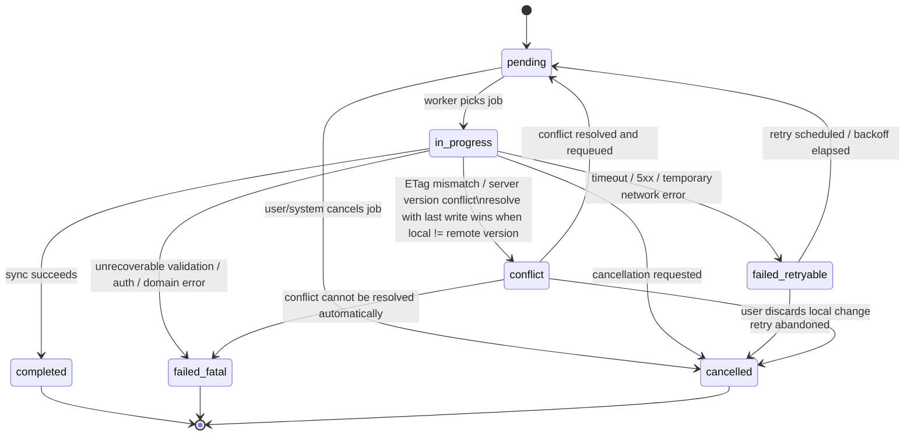
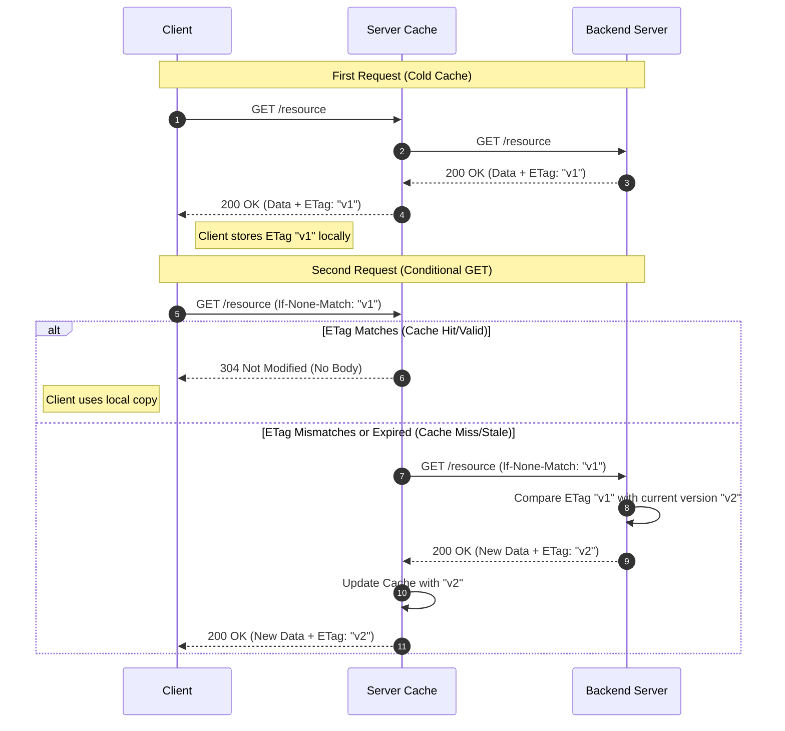

# scaffold_brick

[](https://github.com/felangel/mason)

create a scaffold for the projects that follows clean architecture

_Generated by [mason][1] 🧱_

## Overview 🏗️

This brick generates a complete, production-ready Flutter application scaffold following **Clean Architecture** principles. It provides a robust foundation with offline-first capabilities, advanced caching, background sync, state management, and comprehensive error handling.

## Scaffold Content 📦

The brick creates a fully-configured Flutter project with the following core infrastructure:

### **Core Modules** (`lib/core/`)

#### **1. Database Module** 💾

- **Technology**: Drift (Moor) with SQLite
- **Files**: Database instance, Riverpod providers, query strategies
- **Purpose**: Type-safe local persistent storage with migrations

#### **2. Caching System** 🔄

Advanced offline-first caching layer with two components:

**Persistence Layer**:

- Database Access Objects (DAOs) for type-safe queries
- Cache models and mappers for entity transformation
- Type converters for custom data serialization
- Database transactions for atomic operations
- State stores for cache state management

**Sync Engine**:

- Offline-first synchronization with mutation queues
- ETag-based cache validation (cache hits when ETags match)
- Staleness detection and background refresh
- Conflict resolution (last-write-wins strategy on ETag mismatches)
- Automatic sync coordination
- Complete sync state tracking (pending, in_progress, completed, failed, conflict)

#### **3. Network Module** 🌐

- HTTP client wrapper with interceptor pattern
- Request/response handling
- Centralized network configuration
- Riverpod providers for HTTP client

#### **4. Routing Module** 🛣️

- GoRouter for declarative navigation
- Route definitions and configuration
- Type-safe route generation

#### **5. Error Handling** ⚠️

- Custom exception types
- Failure type definitions
- Exception-to-failure mapping
- Error configuration (Sentry integration ready)

#### **6. Logging** 📝

- Application logger
- Riverpod state change logging
- Sentry integration (configurable via feature flags)

#### **7. Utilities** 🔧

- **Feature Flags**: Runtime feature toggle system
- **Validation**: Validation rule framework
- **Pagination**: Query parameters for paginated requests
- **Result Types**: Success/Failure wrapper types
- **Sorting**: Sort direction and sorting abstractions

#### **8. UI Components** 🎨

- Error screen widget for consistent error display
- Notification system for user feedback
- Common app constants

### **Features Module** (`lib/features/`)

#### **Authentication** 🔐

- Placeholder for auth implementation
- Ready to integrate with your auth provider

#### **Onboarding** 👋

- Presentation layer with pages and widgets
- Reusable onboarding components

## Feature Flags & Configuration 🚩

The scaffold uses environment variables for runtime configuration. Edit the `.env` file to control features:

```env
# API Configuration
API_URL=https://example.com/api
ENABLE_REMOTE_API=false

# Error Reporting
ENABLE_SENTRY=false
SENTRY_DSN=
```

### **Feature Flags Explained**

| Flag                | Type    | Default                   | Purpose                                                       |
| ------------------- | ------- | ------------------------- | ------------------------------------------------------------- |
| `API_URL`           | String  | `https://example.com/api` | Base API endpoint for remote data fetching                    |
| `ENABLE_REMOTE_API` | Boolean | `false`                   | Toggle between offline-only (false) and full sync mode (true) |
| `ENABLE_SENTRY`     | Boolean | `false`                   | Enable crash reporting and error tracking via Sentry          |
| `SENTRY_DSN`        | String  | Empty                     | Sentry project DSN for error reporting                        |

### **Runtime Feature Toggles**

Additional feature flags can be defined in `lib/core/utils/feature_flags.dart` for conditional feature activation at runtime.

## Technology Stack 🛠️

| Technology       | Version | Purpose                             |
| ---------------- | ------- | ----------------------------------- |
| Drift            | ^2.34.0 | SQLite ORM and database             |
| Flutter Riverpod | ^3.4.3  | State management and DI             |
| GoRouter         | ^18.0.1 | Navigation                          |
| Flutter Dotenv   | ^6.0.1  | Environment variable loading        |
| Sentry Flutter   | ^9.30.0 | Error and crash reporting           |
| Freezed          | ^4.0.1  | Code generation for immutable types |
| Build Runner     | ^2.15.0 | Code generation runner              |

## Key Features ✨

- **Offline-First Architecture**: Works seamlessly with or without network connection
- **ETag-Based Caching**: Efficient cache invalidation using HTTP ETags
- **Mutation Queue**: Local changes queued and synced when online
- **Staleness Detection**: Automatic refresh based on timestamp staleness
- **Conflict Resolution**: Last-write-wins strategy for concurrent changes
- **Background Sync**: Automatic synchronization in the background
- **Centralized Error Handling**: Consistent error handling across the app
- **Riverpod Integration**: Type-safe dependency injection and state management
- **Code Generation**: Drift migrations and Freezed immutable types

## Getting Started 🚀

### Prerequisites

Ensure you have Mason and Flutter installed:

```bash
dart pub global activate mason_cli
```

### Usage

Generate a new project using this scaffold:

```bash
mason make scaffold_brick
```

When prompted, provide:

- **Project Name** — Your Flutter app name (e.g., `my_app`, `employee_book`)

### Post-Generation

1. **Update `.env` file**:
   - Set your actual `API_URL`
   - Configure `ENABLE_REMOTE_API` based on your needs
   - Configure Sentry if you want error tracking

2. **Generate code**:

   ```bash
   flutter pub get
   flutter pub run build_runner build
   ```

3. **Run the app**:
   ```bash
   flutter run
   ```

## Caching System Architecture 🔄

## Mutation State Diagram



## Server-Client request response flow



## TODO

- Add sync engine refresh logic
- Add a network connection listener
- Add responsiveness
- Add authentication feature
