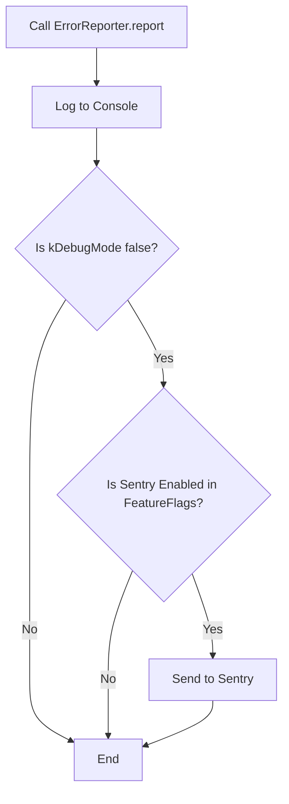

# Error Reporting Design Documentation

## Overview

The `ErrorReporter` is a centralized utility class designed to handle application exceptions. It provides a unified interface to log errors to the local developer console during development and report critical failures to **Sentry** in production environments.

By abstracting the reporting logic, the application remains decoupled from the specific third-party SDK (Sentry), allowing for easier maintenance or migration to alternative tools (e.g., Firebase Crashlytics) in the future.

## Architecture

### Design Pattern

- **Static Utility Class:** The class uses a private constructor `ErrorReporter._()` to prevent instantiation. All functionality is exposed via `static` methods.
- **Conditional Routing:** The class implements logic to determine where an error should be sent based on the build mode and application feature flags.

### Dependencies

- `dart:developer`: Used for high-performance logging via `dev.log`.
- `flutter/foundation.dart`: Used to detect `kDebugMode`.
- `sentry_flutter`: The production error tracking SDK.
- `FeatureFlags`: A custom internal utility used to toggle Sentry reporting via `.env` configuration.

## Key Design Decisions

| Decision                 | Implementation      | Rationale                                                                                                                                                                            |
| :----------------------- | :------------------ | :----------------------------------------------------------------------------------------------------------------------------------------------------------------------------------- |
| **Private Constructor**  | `ErrorReporter._()` | Prevents the class from being instantiated. Since all methods are static, creating an object would be a waste of memory and misleading to other developers.                          |
| **Debug Mode Guard**     | `!kDebugMode`       | Ensures that Sentry quotas are not consumed by development errors. Remote reporting is strictly reserved for Production/Release builds.                                              |
| **`dev.log` vs `print`** | `dart:developer`    | `print()` statements can be stripped from release builds or truncated by some IDEs. `dev.log` is the Flutter standard for detailed logging.                                          |
| **Sentry Scoping**       | `withScope` block   | Passes the optional `message` as a Sentry Tag. This allows developers to filter and group errors in the Sentry Dashboard by "Custom Message" rather than searching raw stack traces. |
| **Dynamic Typing**       | `dynamic error`     | Dart's `catch` block catches `Object`. Since different packages throw different exception types, `dynamic` ensures the reporter can handle any error type without casting failures.  |

## Logic Flow

When `ErrorReporter.report()` is called, the following logic is executed:

1.  **Local Logging (Always):** The error and stack trace are sent to the console using `dev.log`.
2.  **Environment Check:** The reporter checks if the app is running in **Release mode** (`!kDebugMode`).
3.  **Feature Flag Check:** The reporter queries `FeatureFlags.isSentryEnabled`.
4.  **Remote Reporting:** If both conditions are met, the error is dispatched to Sentry.



## API Reference

### `static void report(dynamic error, StackTrace stackTrace, {String? message})`

The primary entry point for error handling.

| Parameter    | Type         | Required | Description                                                 |
| :----------- | :----------- | :------- | :---------------------------------------------------------- |
| `error`      | `dynamic`    | Yes      | The exception or error object caught in the catch block.    |
| `stackTrace` | `StackTrace` | Yes      | The stack trace used to pinpoint the line of failure.       |
| `message`    | `String?`    | No       | A human-readable context message (e.g., "Failed to login"). |

## Usage Guide

### In a Try-Catch Block

```dart
try {
  await someAsyncFunction();
} catch (e, stackTrace) {
  ErrorReporter.report(
    e,
    stackTrace,
    message: 'Failed to perform async operation',
  );
}
```

### Global Integration

Integrated via `ErrorConfig.initErrorHandling()`, which maps `FlutterError.onError` and `PlatformDispatcher.instance.onError` to the `ErrorReporter`.

### Configuration

To enable/disable Sentry reporting without changing code, update the `.env` file:

```env
ENABLE_SENTRY=true
```
