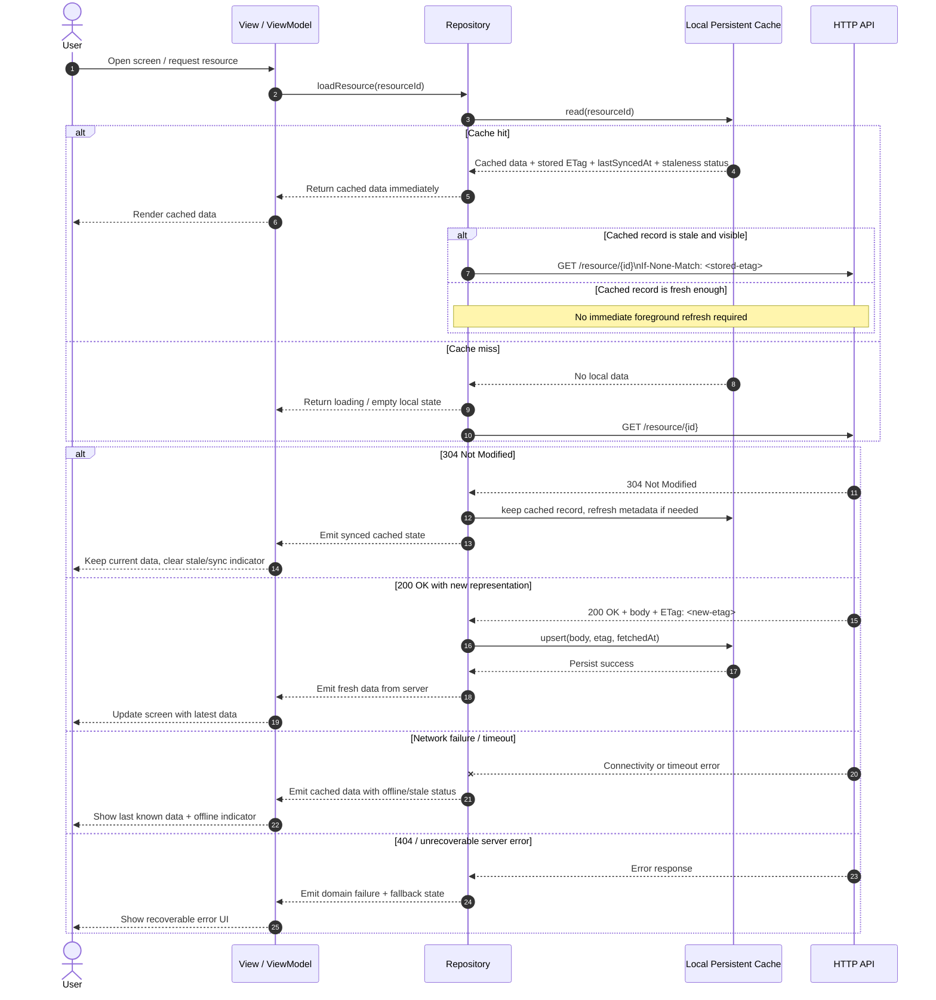
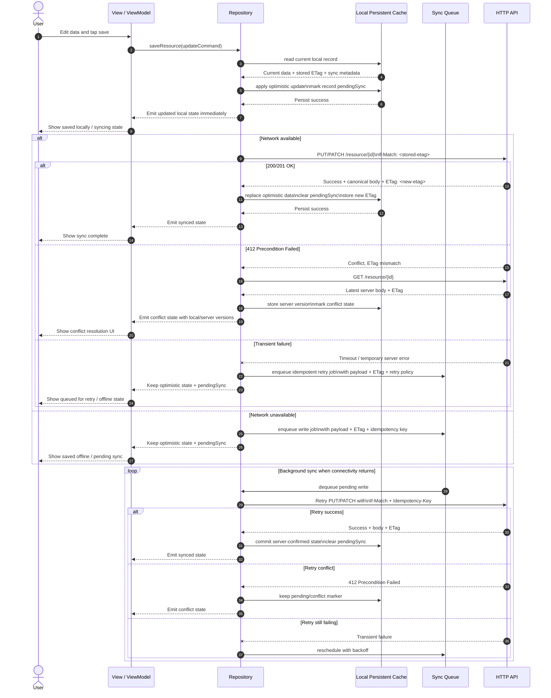
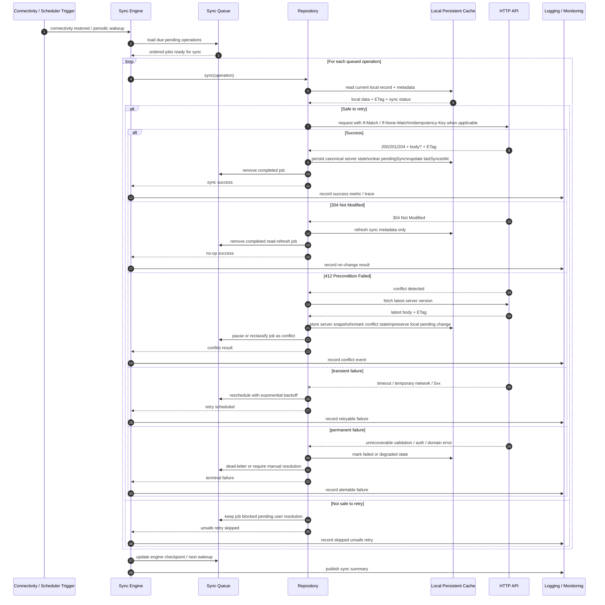
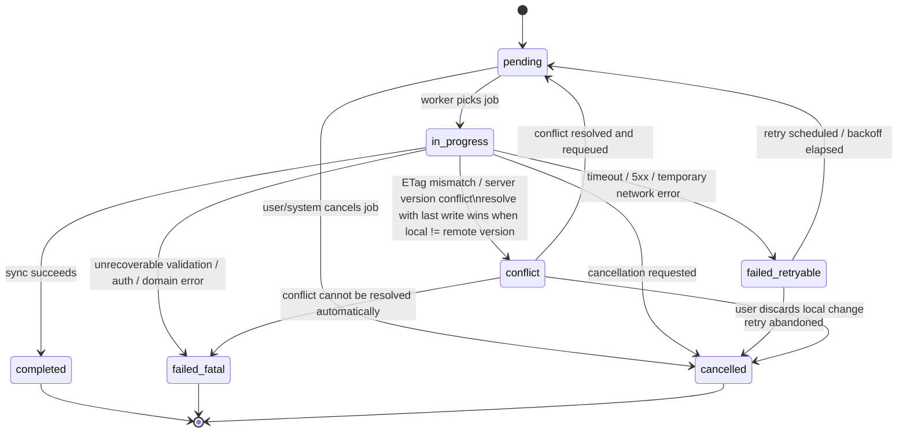
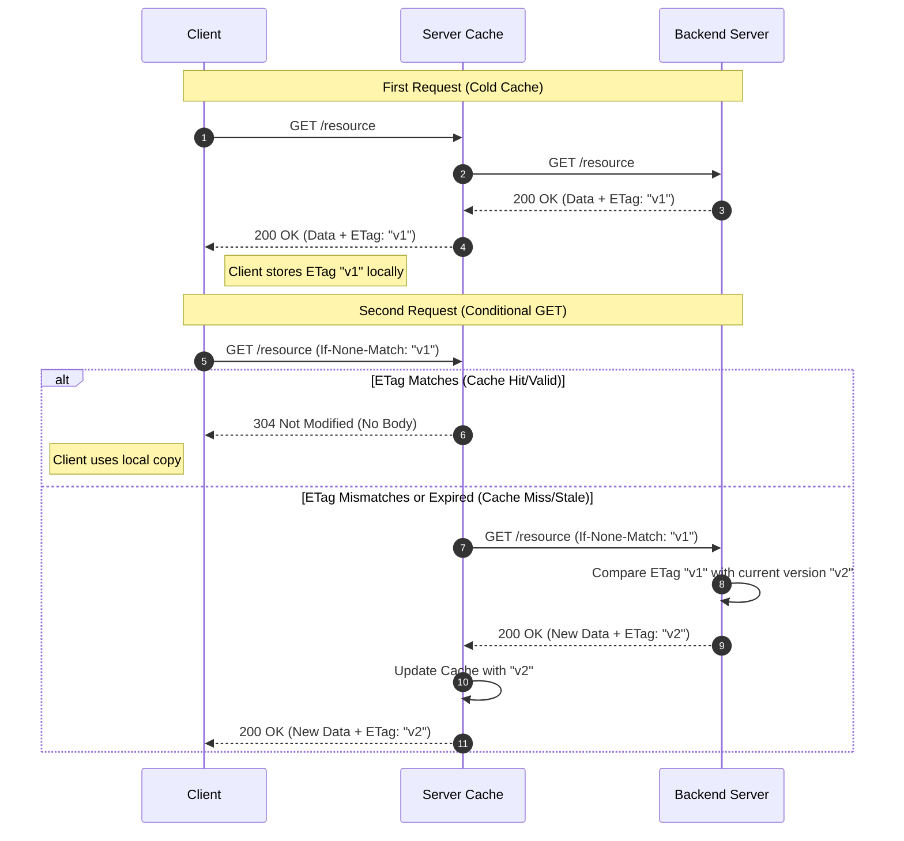
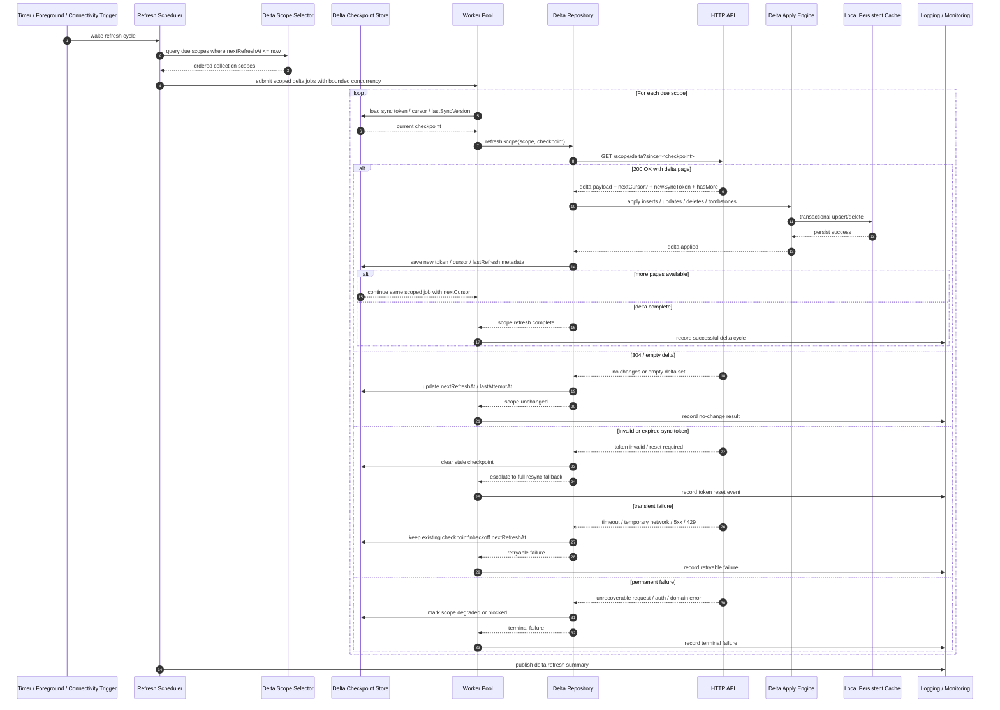
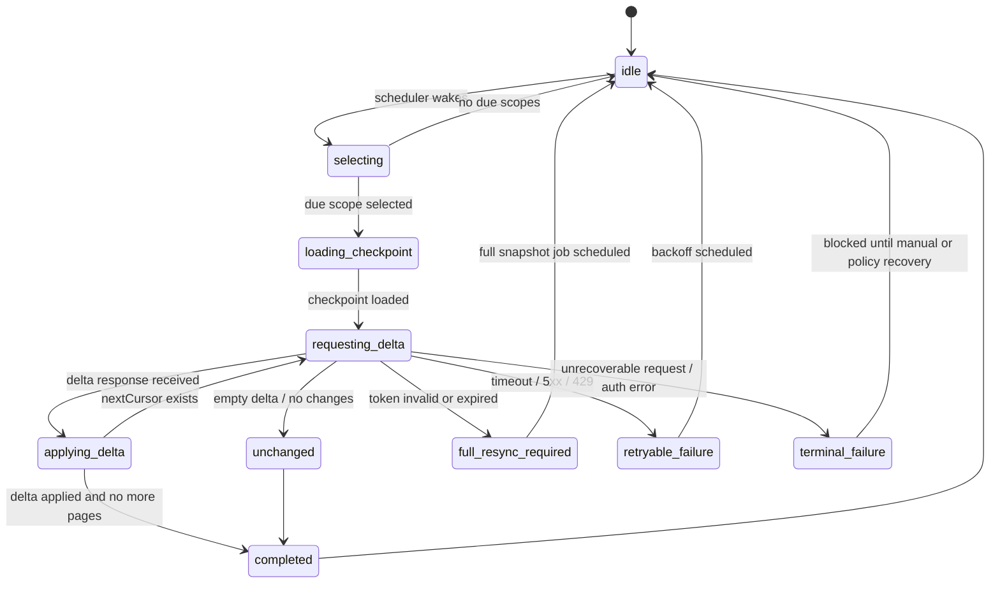

# Offline-First System design

## Read Flow

## Write Flow

## Sync Engine Flow

## Sync Operation State Diagram

Note: a mutation may be committed locally and shown as an immediate optimistic success before remote sync begins. That does not eliminate cancelability. As long as the queued job remains in `pending`, the system can still offer an undo window. Example: after the user archives an item, the app updates the local database immediately, shows a snackbar such as `Item archived. Undo?`, and delays sync for a few seconds. If the user taps `Undo` before the job moves to `in_progress`, the app reverts the local change and marks the queued job as `cancelled` or removes it entirely.

Note: under a last-write-wins policy, a `412 Precondition Failed` should not normally cause the next retry to drop the `If-Match` header. The safer pattern is to fetch the latest server version, decide that the local change should win, then requeue the operation with the new current `ETag` and retry again with `If-Match`. Removing `If-Match` entirely would turn the retry into an unconditional overwrite and can clobber newer remote changes.

## Server-Client request response flow

## Background Refresh System Design

### Delta sync design goals

- refresh collections efficiently without issuing one request per record
- fetch only changes since the last successful sync checkpoint
- reduce network, battery, and backend load compared with per-record polling
- preserve local readability during outages or partial refresh failures
- keep delta checkpoints version-aware and safe to reset when invalidated

### Main components

- `refresh_scheduler`: wakes on timer, app foreground, connectivity restore, or explicit user action
- `delta_selector`: identifies collections or scopes due for refresh instead of individual rows
- `delta_checkpoint_store`: stores per-scope sync token, cursor, high-water mark, or last successful server version
- `delta_repository`: issues collection-level delta requests such as `GET /items/delta?since=<token>`
- `delta_apply_engine`: applies inserts, updates, deletes, and tombstones transactionally to the local database
- `delta_worker_pool`: processes only a bounded number of collection refreshes concurrently
- `delta_backoff_policy`: updates next refresh schedule, retry counters, and jitter after each attempt
- `delta_monitoring`: records delta sizes, latency, retry counts, invalid token events, and full-resync fallbacks

## Background Refresh Flow Using Delta Sync

## Delta Refresh State Diagram

### Delta-specific metadata

- `syncScopeId`: collection, query, tenant, or feature scope being refreshed
- `syncToken`: opaque server-issued token representing the last successful delta checkpoint
- `deltaCursor`: pagination cursor for multi-page delta responses
- `lastSyncVersion`: optional monotonic server version if the API uses versions instead of opaque tokens
- `lastFullResyncAt`: timestamp of the most recent full snapshot rebuild
- `requiresFullResync`: flag set when the delta token is invalidated
- `deltaPageSize`: requested or negotiated page size for delta responses
- `tombstoneRetentionUntil`: time until delete tombstones must be retained locally for sync safety

## Companion Notes

### Suggested local cache record shape

- `id`: stable resource identifier
- `data`: latest locally stored canonical or optimistic payload
- `etag`: last known server `ETag` for conditional read/write requests
- `lastSyncedAt`: timestamp of the last confirmed successful sync with the server
- `lastFetchedAt`: timestamp of the last fetch attempt that returned usable data
- `syncStatus`: enum such as `synced`, `pending_sync`, `conflict`, `stale`, `failed`
- `version`: optional local monotonic version for merge/conflict support
- `idempotencyKey`: optional key attached to queued writes that may be retried safely

### Suggested sync metadata for queued writes

- `operationId`: unique identifier for the queued sync job
- `resourceId`: target resource identifier
- `operationType`: create, update, delete, or patch. `patch` means a partial update that sends only the changed fields, typically using HTTP `PATCH`, instead of replacing the full resource.
- `payload`: serialized write command to replay
- `etagAtEditTime`: `ETag` value that was current when the user made the change
- `retryCount`: number of attempts already made
- `nextRetryAt`: scheduled time for the next retry attempt
- `lastErrorCode`: latest mapped failure code
- `lastErrorMessage`: latest human-readable diagnostic message
- `createdAt`: when the queued operation was first stored
- `updatedAt`: when the queued operation was last retried or mutated
- `nextRefreshAt`: scheduled time for the next background refresh attempt
- `refreshPriority`: optional priority used by the background refresh scheduler
- `refreshGroupKey`: optional deduplication or batching key for collection refresh
- `syncToken`: last successful delta checkpoint token for a collection or scope
- `deltaCursor`: current cursor when a delta refresh spans multiple pages
- `requiresFullResync`: whether the next refresh must fall back to a full snapshot

### Practical notes

- Reads should prefer cache-first rendering. If the cached record is stale and needed now by a visible foreground read, return it immediately and trigger an immediate refresh using `If-None-Match` rather than waiting only for the background delta scheduler.
- Writes should update local state first, then sync with `If-Match` when an `ETag` is available.
- A robust mutation workflow is usually: commit to the local database first, create a sync operation record, then let the sync engine send it immediately if network is available and no higher-priority queued work blocks it; otherwise keep it in the queue as `pending`.
- Retry only idempotent or explicitly protected writes, ideally with an `Idempotency-Key`.
- Retryable failures should typically use exponential backoff, for example `delay = baseDelay * 2^retryCount`, while enforcing both a `maxDelay` cap and a `maxRetries` limit so retries do not grow forever or loop indefinitely.
- Add jitter to the computed retry delay so many devices do not retry in lockstep. This spreads load across time, reduces thundering-herd spikes, and gives the backend a better chance to recover under outage conditions.
- When the API supports delta sync, background refresh should prefer collection- or scope-level delta requests over per-record polling. The scheduler should select due scopes, load their `syncToken`, process only a bounded number concurrently, and update checkpoints transactionally after each successful delta application.
- If a delta token becomes invalid, the system should not guess a new checkpoint. It should clear the token, mark the scope as requiring full resync, and schedule a snapshot rebuild explicitly.
- Conflict states should preserve both the local pending change and the latest server snapshot for resolution.

## Eviction Policies

### Common policies

- `TTL`: evict data after a fixed age
- `LRU`: evict least recently used records first
- `LFU`: evict least frequently used records first
- `FIFO`: evict oldest inserted records first
- `size-based`: evict when storage usage exceeds a byte threshold
- `count-based`: keep only the newest or most relevant N records
- `staleness-based`: evict data whose freshness window expired and is cheap to refetch
- `priority-tier`: evict low-value or non-critical data before important data
- `cost-aware`: keep expensive-to-download or expensive-to-recompute data longer
- `sync-state-aware`: never evict pending, conflicted, or unsynced records
- `scope-based`: evict by workspace, user, tenant, feature, or collection
- `event-driven`: evict on logout, account switch, permission loss, or feature disablement
- `version-based`: evict data that is incompatible with a new schema or content version
- `tombstone-retention`: prune delete tombstones after the sync safety window expires
- `manual`: let the user clear cached or offline data explicitly

### Recommended offline-first rule

- Use hybrid eviction policies instead of a single global rule.
- Apply aggressive eviction only to cache-like, replaceable, or low-value data.
- Do not evict user-owned, promised-offline, pending-sync, or conflict-state data unless the product explicitly allows that loss.
- Prefer size, age, value, and sync-state based retention policies over a naive fixed row cap per table.
