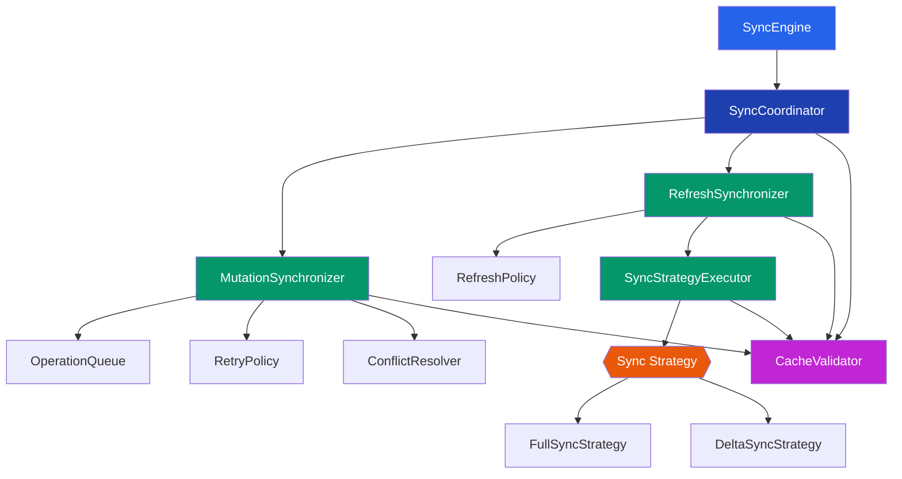
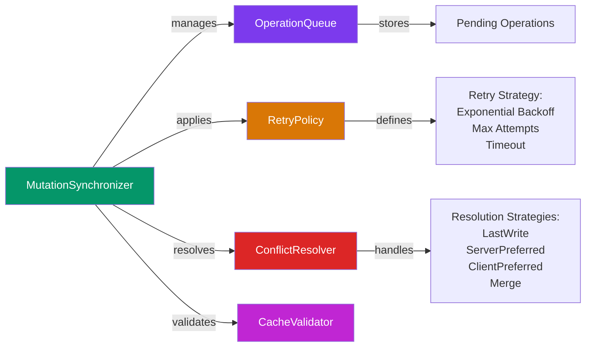

# Sync Engine Architecture

## Table of Contents

1. [Overview](#overview)
2. [Core Components](#core-components)
3. [Component Details](#component-details)
4. [Data Flow](#data-flow)
5. [Synchronization Strategies](#synchronization-strategies)
6. [Error Handling](#error-handling)
7. [Best Practices](#best-practices)

---

## Overview

The **Sync Engine** is a comprehensive synchronization framework designed to manage bidirectional data synchronization between a local application state and remote servers. It handles mutations (local changes), refreshes (pulling updates), and resolves conflicts while maintaining data integrity through validation and intelligent retry policies.

### Key Features

- **Mutation Handling**: Queue and synchronize local changes to the server
- **Conflict Resolution**: Intelligent strategies for handling concurrent modifications
- **Multiple Sync Strategies**: Support for both full and incremental synchronization
- **Retry Logic**: Automatic retry mechanisms with configurable policies
- **Cache Validation**: Ensure data integrity across all operations
- **Refresh Management**: Periodic or on-demand updates from the remote source

---

## Core Components



---

## Component Details

### SyncEngine

The **SyncEngine** is the main entry point and orchestrator of the entire synchronization system.

**Responsibilities:**

- Initialize and manage the lifecycle of all sync components
- Provide public API for sync operations
- Coordinate between different sync types
- Handle overall error states

**Implementation:**

```dart
abstract class SyncEngine {
  /// Initialize the sync engine
  Future<void> start();

  /// Stop all sync operations
  Future<void> stop();

  /// Enqueue a mutation for synchronization
  Future<String> enqueueMutation(SyncOperation operation);

  /// Request an immediate refresh
  Future<void> requestRefresh();

  /// Get current sync status
  Stream<SyncStatus> get statusStream;
}

class SyncEngineImpl implements SyncEngine {
  late final SyncCoordinator _coordinator;
  late final SyncMutationSynchronizer _mutationSync;
  late final SyncRefreshSynchronizer _refreshSync;
  late final CacheValidator _validator;

  final _statusController = StreamController<SyncStatus>.broadcast();

  @override
  Future<void> start() async {
    try {
      await _coordinator.initialize();
      await _mutationSync.start();
      await _refreshSync.start();
      _statusController.add(SyncStatus.ready);
    } catch (e) {
      _statusController.addError(e);
      rethrow;
    }
  }

  @override
  Future<void> stop() async {
    await _mutationSync.stop();
    await _refreshSync.stop();
    await _coordinator.dispose();
    await _statusController.close();
    _statusController.add(SyncStatus.stopped);
  }

  @override
  Future<String> enqueueMutation(SyncOperation operation) {
    return _coordinator.enqueueMutation(operation);
  }

  @override
  Future<void> requestRefresh() {
    return _coordinator.coordinateRefresh();
  }

  @override
  Stream<SyncStatus> get statusStream => _statusController.stream;
}
```

---

### SyncCoordinator

The **SyncCoordinator** acts as the central hub that manages all synchronization activities and ensures components work harmoniously.

**Responsibilities:**

- Route operations to appropriate synchronizers
- Manage operation priorities and sequencing
- Coordinate between mutation and refresh operations
- Delegate cache validation across components
- Handle sync state transitions

**Implementation:**

```dart
abstract class SyncCoordinator {
  Future<void> initialize();
  Future<void> dispose();
  Future<String> enqueueMutation(SyncOperation mutation);
  Future<void> coordinateRefresh();
  Future<SyncResult> validateAndSync();
}

class SyncCoordinatorImpl implements SyncCoordinator {
  final SyncMutationSynchronizer _mutationSync;
  final SyncRefreshSynchronizer _refreshSync;
  final CacheValidator _validator;

  final _mutex = Mutex();
  final _operationQueue = Queue<SyncOperation>();

  @override
  Future<void> initialize() async {
    await _validator.initialize();
  }

  @override
  Future<String> enqueueMutation(SyncOperation mutation) async {
    await _mutex.protect(() async {
      final isValid = await _validator.validateOperation(mutation);
      if (!isValid) {
        throw InvalidOperationException('Operation validation failed');
      }
      _operationQueue.add(mutation);
    });

    return _mutationSync.enqueueMutation(mutation);
  }

  @override
  Future<void> coordinateRefresh() async {
    await _mutex.protect(() async {
      // Ensure no mutations are in flight
      final hasPendingMutations =
          await _mutationSync.hasPendingOperations();

      if (hasPendingMutations) {
        await _mutationSync.processPendingOperations();
      }

      // Perform refresh
      await _refreshSync.performRefresh();

      // Validate cache after refresh
      final isValid = await _validator.validateCache();
      if (!isValid) {
        throw CacheValidationException('Cache validation failed');
      }
    });
  }

  @override
  Future<SyncResult> validateAndSync() async {
    final cacheValid = await _validator.validateCache();
    if (!cacheValid) {
      return SyncResult(
        success: false,
        error: 'Cache validation failed',
      );
    }

    try {
      await coordinateRefresh();
      return SyncResult(success: true);
    } catch (e) {
      return SyncResult(success: false, error: e.toString());
    }
  }

  @override
  Future<void> dispose() async {
    _operationQueue.clear();
    await _validator.dispose();
  }
}
```

---

### MutationSynchronizer

The **MutationSynchronizer** handles all local changes (creates, updates, deletes) and ensures they reach the server.



**Responsibilities:**

- Queue outgoing mutations for the server
- Apply retry policies for failed operations
- Resolve conflicts between local and remote changes
- Maintain operation state (pending, failed, succeeded)

**Implementation:**

```dart
abstract class SyncMutationSynchronizer {
  Future<String> enqueueMutation(SyncOperation mutation);
  Future<void> processPendingOperations();
  Future<SyncData> handleConflict(
    SyncData localData,
    SyncData remoteData,
  );
  Future<void> retryFailedOperation(String operationId);
  Future<bool> hasPendingOperations();
  Future<void> start();
  Future<void> stop();
}

class SyncMutationSynchronizerImpl
    implements SyncMutationSynchronizer {
  final OperationQueue _operationQueue;
  final RetryPolicy _retryPolicy;
  final ConflictResolver _conflictResolver;
  final CacheValidator _validator;
  final ApiClient _apiClient;

  late Timer _processTimer;

  @override
  Future<String> enqueueMutation(SyncOperation mutation) async {
    final operationId = mutation.id;
    await _operationQueue.enqueue(mutation);
    return operationId;
  }

  @override
  Future<void> processPendingOperations() async {
    while (true) {
      final operation = await _operationQueue.dequeue();
      if (operation == null) break;

      try {
        final response = await _apiClient.sendMutation(operation);

        if (response.success) {
          await _operationQueue.markSucceeded(operation.id);
        } else if (response.isConflict) {
          final resolvedData = await _conflictResolver.resolve(
            localData: operation.data,
            remoteData: response.data!,
            strategy: ConflictStrategy.serverPreferred,
          );
          await _operationQueue.updateOperation(
            operation.id,
            resolvedData,
          );
        }
      } on Exception catch (e) {
        final shouldRetry = _retryPolicy.shouldRetry(
          operation,
          e,
        );

        if (shouldRetry) {
          final delay = _retryPolicy.getNextDelay(operation);
          await Future.delayed(delay);
          // Re-enqueue for retry
          await _operationQueue.enqueue(operation);
        } else {
          await _operationQueue.markFailed(operation.id, e.toString());
        }
      }
    }
  }

  @override
  Future<SyncData> handleConflict(
    SyncData localData,
    SyncData remoteData,
  ) {
    return _conflictResolver.resolve(
      localData: localData,
      remoteData: remoteData,
      strategy: ConflictStrategy.merge,
    );
  }

  @override
  Future<void> retryFailedOperation(String operationId) async {
    final operation = await _operationQueue.getById(operationId);
    if (operation != null) {
      await _operationQueue.enqueue(operation);
    }
  }

  @override
  Future<bool> hasPendingOperations() async {
    return await _operationQueue.count() > 0;
  }

  @override
  Future<void> start() async {
    _processTimer = Timer.periodic(
      const Duration(seconds: 5),
      (_) => processPendingOperations(),
    );
  }

  @override
  Future<void> stop() async {
    _processTimer.cancel();
  }
}
```

#### OperationQueue

A persistent queue that stores pending mutations awaiting synchronization.

```dart
abstract class OperationQueue {
  Future<void> enqueue(SyncOperation operation);
  Future<SyncOperation?> dequeue();
  Future<SyncOperation?> getById(String id);
  Future<void> markSucceeded(String operationId);
  Future<void> markFailed(String operationId, String error);
  Future<void> updateOperation(String operationId, SyncData data);
  Future<int> count();
  Future<void> clear();
}

class HiveOperationQueue implements OperationQueue {
  late Box<SyncOperation> _box;

  @override
  Future<void> enqueue(SyncOperation operation) async {
    await _box.put(operation.id, operation);
  }

  @override
  Future<SyncOperation?> dequeue() async {
    if (_box.isEmpty) return null;

    final operations = _box.values.toList();
    operations.sort((a, b) => a.createdAt.compareTo(b.createdAt));

    return operations.isNotEmpty ? operations.first : null;
  }

  @override
  Future<SyncOperation?> getById(String id) async {
    return _box.get(id);
  }

  @override
  Future<void> markSucceeded(String operationId) async {
    final operation = await getById(operationId);
    if (operation != null) {
      final updated = operation.copyWith(
        status: OperationStatus.succeeded,
        updatedAt: DateTime.now(),
      );
      await _box.put(operationId, updated);
    }
  }

  @override
  Future<void> markFailed(String operationId, String error) async {
    final operation = await getById(operationId);
    if (operation != null) {
      final updated = operation.copyWith(
        status: OperationStatus.failed,
        error: error,
        updatedAt: DateTime.now(),
      );
      await _box.put(operationId, updated);
    }
  }

  @override
  Future<void> updateOperation(
    String operationId,
    SyncData data,
  ) async {
    final operation = await getById(operationId);
    if (operation != null) {
      final updated = operation.copyWith(
        data: data,
        updatedAt: DateTime.now(),
      );
      await _box.put(operationId, updated);
    }
  }

  @override
  Future<int> count() async {
    return _box.length;
  }

  @override
  Future<void> clear() async {
    await _box.clear();
  }
}
```

#### RetryPolicy

Defines the retry behavior for failed synchronization attempts.

```dart
class RetryPolicy {
  final int maxRetries;
  final Duration initialDelay;
  final Duration maxDelay;
  final BackoffStrategy backoffStrategy;
  final Duration timeout;

  RetryPolicy({
    this.maxRetries = 3,
    this.initialDelay = const Duration(seconds: 1),
    this.maxDelay = const Duration(minutes: 1),
    this.backoffStrategy = BackoffStrategy.exponential,
    this.timeout = const Duration(seconds: 30),
  });

  bool shouldRetry(
    SyncOperation operation,
    Exception error,
  ) {
    // Don't retry if max attempts exceeded
    if (operation.retryCount >= maxRetries) {
      return false;
    }

    // Check if error is transient
    if (error is TimeoutException) {
      return true;
    }

    if (error is SocketException) {
      return true;
    }

    if (error is HttpException) {
      // Check for retryable HTTP status codes
      if (error.toString().contains('429') ||
          error.toString().contains('503')) {
        return true;
      }
    }

    return false;
  }

  Duration getNextDelay(SyncOperation operation) {
    final retryCount = operation.retryCount;

    final delayMs = switch (backoffStrategy) {
      BackoffStrategy.exponential =>
        initialDelay.inMilliseconds *
        (pow(2, ret
```
